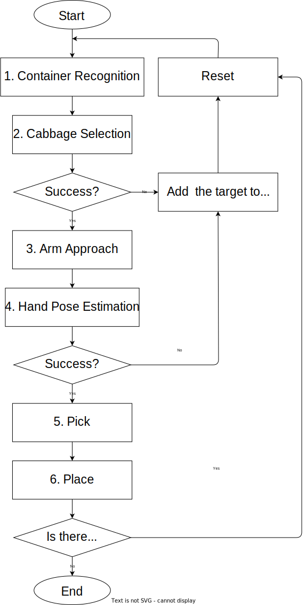

# ros_dev

## launch sample

<!-- roslaunch myrobot_moveit bringup.launch grasp_only:=true pre_move:=true record_all:=true sim:=false -->
### melodic
- Gazebo:
roslaunch myrobot_moveit bringup.launch
- 実機:
roslaunch myrobot_moveit bringup.launch
roslaunch myrobot_moveit right_denso_robot_control.launch
roslaunch myrobot_moveit left_denso_robot_control.launch
roslaunch myrobot_moveit auto_planning.launch


<!-- roslaunch myrobot_moveit bringup.launch used_camera:=right_camera sim:=false
roslaunch myrobot_moveit bringup_hand.launch used_camera:=right_camera sim:=false auto_planning:=false -->

### Detect:
- Gazebo:
roslaunch detect bringup.launch
- 実機:
roslaunch detect ar_track_alver.launch
roslaunch detect bringup.launch 

subome radius 19 / 2 = 9.5mm

カメラの切り替えは、senserのところとmulticameraのところをいじる

## 概要
denso_rosと、画像処理や機械学習系のモジュールが依存する環境(rosやpthonのver)が異なるため、
コンテナを２つ作成し、実行環境を切り分けている。

* melodicコンテナ： Ubuntu18.04, python2, ros-melodic, moveitやgazebo, sensorまわりを扱う
* noeticコンテナ：　Ubuntu20.04, python3, ros-noetic, 画像処理、把持点検出などを扱う

２つのコンテナはdockerネットワークによって接続されており、melodicコンテナをROSマスターとして動作する 
(roscoreはmelodicコンテナ内で起動される)。


## makeコマンドについて 
### 初期設定
依存パッケージのリポジトリのクローンやdockerネットワークの作成、イメージのビルドなどを行う
```
make init
```

### コンテナの起動
melodicコンテナをマスターにする場合（デフォルト）
```
make start
```
ホストをマスターにする場合（外部マシンと連携する場合など、ホストにもROS環境を要求する）
```
make start-host
```

### コンテナの停止
```
make stop
```

### コンテナへのアタッチ
```
make melodic // melodicコンテナへのアタッチ
make noetic  // noeticコンテナへのアタッチ
```

## パッケージについて
### melodic
* myrobot_description: 双椀ロボットのurdfやworld用のモデル置き場
* myrobot_moveit_config: moveit用の設定やデモファイルの置き場
* myrobot_moveit: ロボットへの接続や制御用のスクリプト置き場

* public/denso_robot_ros: denso_robot_rosをフォークしコントロールノードを一部改修してある

### noetic
* detect: 画像処理や把持検出用のスクリプト置き場

## Examples
### moveitとgazeboによるシミュレーション
(初回実行時)
```
// ホスト
make init // 初期設定(初回のみ)
make start // コンテナの起動
make melodic // コンテナへのアタッチ
```
```
// melodicコンテナ
roslaunch myrobot_moveit_config demo_gazebo.launch // moveitとgazeboによるシミュレーション
```
```
// ホスト
make stop // コンテナの停止
```

## フローチャート


## 参考情報
### VSCodeのおすすめ拡張機能
* RemoteContainer: コンテナ内の環境を使って開発ができる。